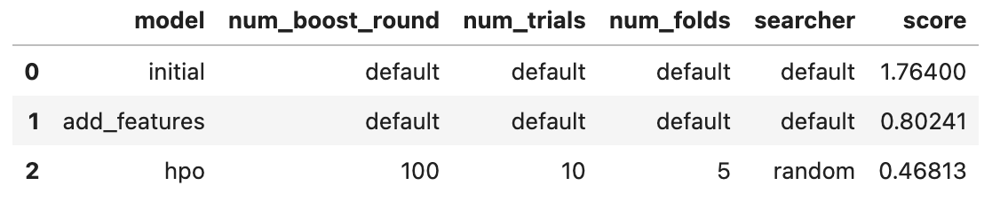
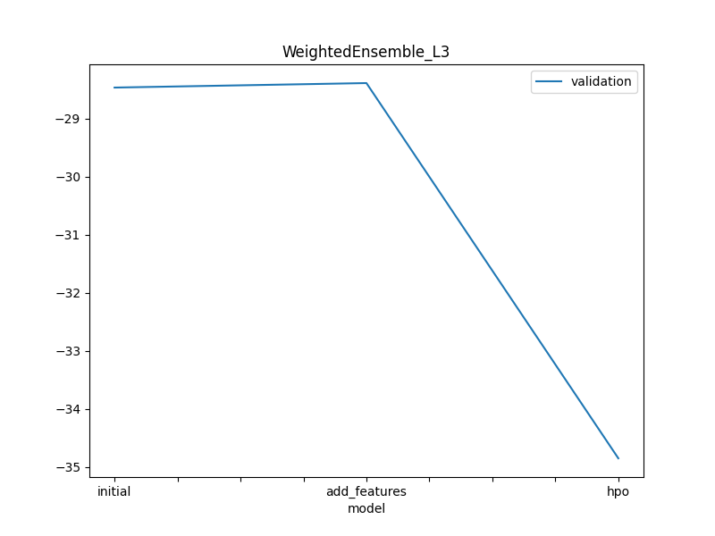
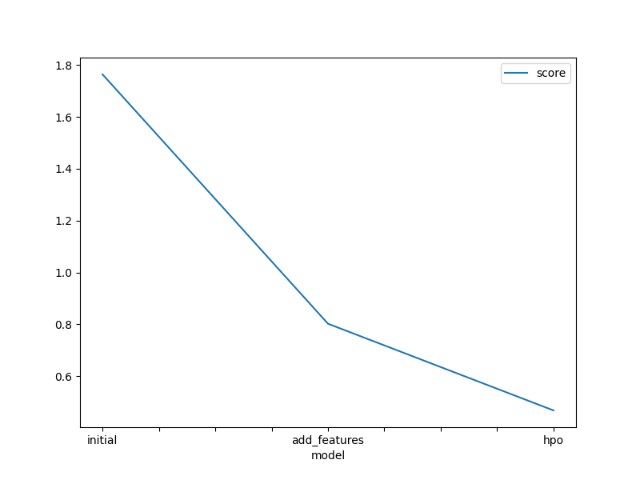

# Report: Predict Bike Sharing Demand with AutoGluon Solution

#### Bhavya Singh

## Initial Training

### What did you realize when you tried to submit your predictions? What changes were needed to the output of the predictor to submit your results?

When I attempted to submit my initial training prediction results, I realized that we needed to count the number of negative predictions that could be achieved using RMSE evaluation metrics. I knew that Kaggle only accepts predictions that are greater than zero. As a result, we must count these negative values in our predictions and, essentially, set them to zero. Then, we can assign these predictions to the submission dataframe and submit it to Kaggle.

### What was the top ranked model that performed?

The third model, which was trained using hyperparameter optimization, received the highest ranking. The top-ranked model had a Kaggle RMSE score of `0.46813`.

## Exploratory data analysis and feature creation

### What did the exploratory analysis find and how did you add additional features?

The first discovery was that a datetime column with an object dtype can be converted to a datetime dtype, and we can add more features by splitting a separate column of year, month, day, hour, and day_fweek from the datetime column. The second finding came from plotting the histogram of the training data during EDA, which provided insight into the distributions of each feature in the data. Season and weather features are more informative among categorical data, whereas holiday and workingday only have a binary distribution. As a result, I converted informative season and weather data to categorical type from int64. The third finding was how wind affected demand and how it combined with weather to produce another feature.

### How much better did your model preform after adding additional features and why do you think that is?

After I added more features to my model, it improved. The Kaggle score for root_mean_square_error (RMSE) decreased from `1.76400` to `0.80241`. I believe it is because additional features and categorized data helped the model in learning the related patterns between the feature and the target.

## Hyper parameter tuning

### How much better did your model preform after trying different hyper parameters?

Tuning the hyperparameters such as num_trials, num_folds, and searcher had a significant impact on model performance. The best Kaggle RMSE score obtained by experimenting with different hyperparameters is `0.46813`.

### If you were given more time with this dataset, where do you think you would spend more time?

I'll try to conduct the following experiments:

- Try out different feature engineering techniques on the data.
- Read the details of the AutoGluon documentation, particularly TabularPredictor().fit(), and investigate the available parameters to tune.
- Choose the best-trained model and tune it.
- Train using different model algorithms, such as KNN, and XGBoost.

### Create a table with the models you ran, the hyperparameters modified, and the kaggle score.

### Create a line plot showing the top model score for the three (or more) training runs during the project.

### Create a line plot showing the top kaggle score for the three (or more) prediction submissions during the project.

## Summary

In this project, the regression model was trained using AutoGluon to forecast bike sharing demand. The dataset is available on Kaggle and includes historical data from bike sharing for training, testing, and submission. All of the necessary packages, including AutoGluon and Kaggle, have been installed, allowing you to download the dataset using the command via Notebook.

Then try to read the dataframe and remove any unnecessary features from the train data that are not present in the test data. The initial model was trained on data that had been less thoroughly analyzed and had few features. After completing the initial Kaggle submission, the initial RMSE score was achieved at `1.76400`.

The next step involved exploratory data analysis (EDA) and feature creation. Feature engineering was performed using the datetime and weather/wind columns, and the data distribution was visualized using a histogram plot. The training after feature engineering improved the model's performance. This trained model achieved a Kaggle RMSE score of `0.80241`.

Hyperparameter tuning was performed following EDA. Trying different combinations of hyper parameter options resulted in significantly better performance, up to `0.46813` RMSE. Tuning hyperparameters like presets, time_limit, num_trials, num_folds, and searcher had a significant impact on the results.
